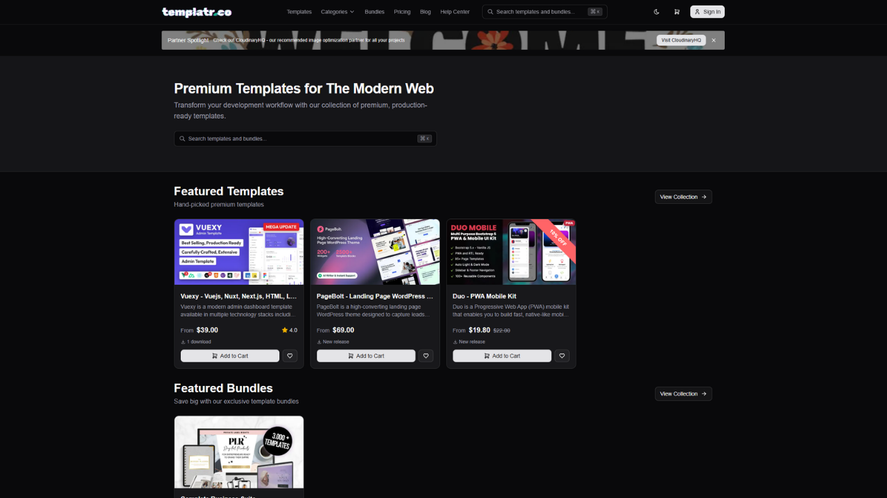
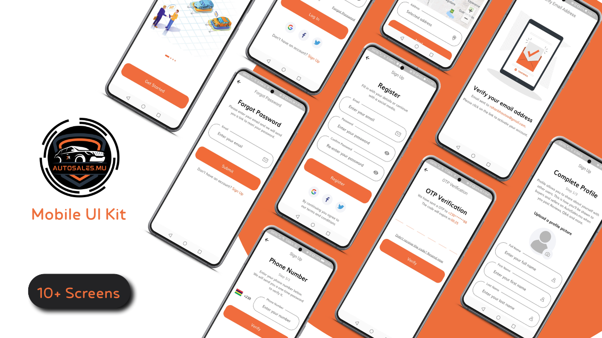
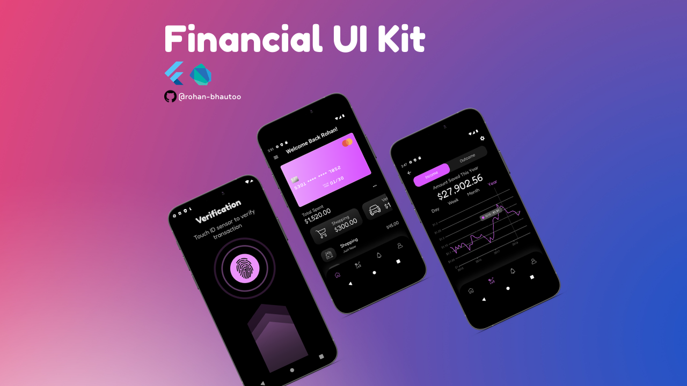

<!--
  ╔═══════════════════════════════════════════════════════════════════════════╗
  ║  ROHAN BHAUTOO - GITHUB PROFILE README                                  ║
  ╠═══════════════════════════════════════════════════════════════════════════╣
  ║                                                                         ║
  ║  SETUP:                                                                 ║
  ║  1. Copy this file to rohan-bhautoo/rohan-bhautoo repo as README.md     ║
  ║  2. Create an 'images/' folder in that repo                             ║
  ║  3. Add screenshots for templatr & Virtual Boutique (see TODO comments) ║
  ║  4. Replace YOUR_DEMO_URL placeholders with your actual live URLs       ║
  ║                                                                         ║
  ║  SCREENSHOTS: Use 1280×720 (16:9) for consistency across all cards.     ║
  ║  Take a browser screenshot at that resolution for the best results.     ║
  ║                                                                         ║
  ╚═══════════════════════════════════════════════════════════════════════════╝
-->

&nbsp;
&nbsp;

 

  
   
  A selection of projects I've designed and built.

 

<table>
  <tr>
    <td width="50%" valign="top">
      <h3 align="center"><a href="https://github.com/rohan-bhautoo/templatr">templatr</a></h3>
      

        
      

      

        Full-stack marketplace for premium web templates. User auth, Paddle payments, admin dashboard, email notifications, and i18n across 4 languages.
      

      

        
        
        
        
        
      

    </td>
    <td width="50%" valign="top">
      <h3 align="center"><a href="https://github.com/rohan-bhautoo/gta-vi-landing-page">GTA VI Landing Page</a></h3>
      

        
      

      

        Cinematic fan-made landing page with scroll-driven video playback, mask reveal animations, parallax character profiles, and horizontal location exploration.
      

      

        
        
        
        
        
      

      
<a href="https://gta-vi-landing-page-1.vercel.app/">Live Demo</a>

    </td>
  </tr>
</table>

<table>
  <tr>
    <td width="50%" valign="top">
      <h3 align="center"><a href="https://github.com/rohan-bhautoo/AutoRental-old">AutoSales</a></h3>
      

        
      

      

        Cross-platform car rental and sales mobile app. Browse vehicles, view details, and manage bookings with a clean, intuitive interface.
      

      

        
        
      

    </td>
    <td width="50%" valign="top">
      <h3 align="center"><a href="https://github.com/rohan-bhautoo/Game-Website-React">Game Library</a></h3>
      

        
      

      

        Game discovery platform inspired by RAWG.io. Search, filter by genre and platform, toggle dark/light mode, and browse a responsive game catalog.
      

      

        
        
        
        
        
      

    </td>
  </tr>
</table>

<table>
  <tr>
    <td width="50%" valign="top">
      <h3 align="center"><a href="https://github.com/rohan-bhautoo/virtual-boutique">Virtual Boutique</a></h3>
      

        
      

      

        Mobile e-commerce application with product browsing, cart management, and a seamless checkout experience.
      

      

        
        
      

    </td>
    <td width="50%" valign="top">
      <h3 align="center"><a href="https://github.com/rohan-bhautoo/FitBudget-Solutions">FitBudget</a></h3>
      

        
      

      

        Cross-platform mobile budgeting app. Track expenses, set savings goals, and visualize your finances with interactive charts.
      

      

        
        
      

    </td>
  </tr>
</table>

<table>
  <tr>
    <td width="50%" valign="top">
      <h3 align="center"><a href="https://github.com/rohan-bhautoo/SkillBoost-Hub">SkillBoost Hub</a></h3>
      

        
      

      

        Learning management platform with secure authentication, a dynamic course catalog, and a personalized learning experience.
      

      

        
        
        
        
        
      

    </td>
    <td width="50%" valign="top">
      <h3 align="center"><a href="https://github.com/rohan-bhautoo/Bugatti-Website">Bugatti Website</a></h3>
      

        
      

      

        Automotive single-page application with dynamic content switching, user authentication, and a car catalog backed by MariaDB.
      

      

        
        
        
      

    </td>
  </tr>
</table>

  <a href="https://github.com/rohan-bhautoo?tab=repositories">See all projects &rarr;</a>

 

  

 

**Frontend**

**Backend**

**Mobile**

**Tools**

 

  

 

  <picture>
    <source media="(prefers-color-scheme: dark)" srcset="https://github-readme-streak-stats.herokuapp.com?user=rohan-bhautoo&theme=tokyonight&hide_border=true"/>
    
  </picture>
  <picture>
    <source media="(prefers-color-scheme: dark)" srcset="https://github-readme-stats-sigma-five.vercel.app/api?username=rohan-bhautoo&show_icons=true&hide_border=true&count_private=true&theme=tokyonight"/>
    
  </picture>

 

  <picture>
    <source media="(prefers-color-scheme: dark)" srcset="https://github-readme-activity-graph.vercel.app/graph?username=rohan-bhautoo&theme=tokyo-night&hide_border=true&area=true"/>
    
  </picture>

 

